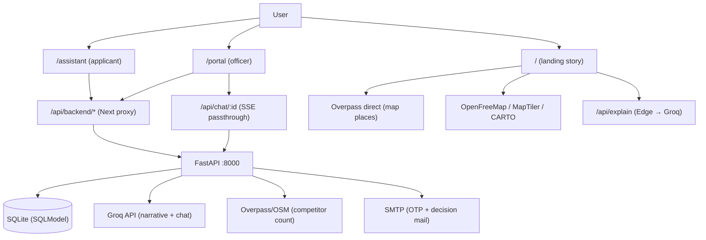
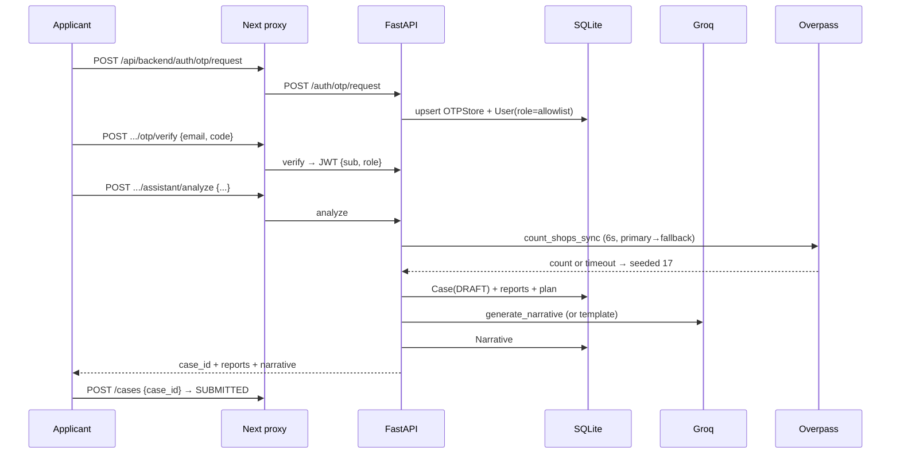
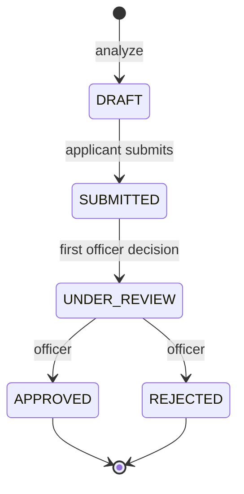

# GramIntel — PROJECT_OVERVIEW.md

> **What this file is:** a complete, evidence-based knowledge document describing the GramIntel project **as it currently exists** in this repository. Every factual claim cites a source file with a line number (`path:line`). Anything that could not be verified in the codebase is explicitly marked **Unknown / Not found in codebase**. No features, decisions, or history have been invented.
>
> **How it was produced:** systematic inspection of the full repo (frontend source, backend source, clients package, configs, specs, scripts, git history) plus targeted verification commands. Generated 2026-09-04.
>
> **Security note:** environment variable *names* are listed so developers know what to configure. **No secret values are recorded here.**

---

## Table of contents

1. [Project identity](#1-project-identity)
2. [Problem & solution](#2-problem--solution)
3. [Target users & use cases](#3-target-users--use-cases)
4. [User journeys (actual flows)](#4-user-journeys-actual-flows)
5. [Feature inventory](#5-feature-inventory)
6. [Technical architecture](#6-technical-architecture)
7. [Technology stack](#7-technology-stack)
8. [Project structure](#8-project-structure)
9. [API reference (as implemented)](#9-api-reference-as-implemented)
10. [Database schema (as implemented)](#10-database-schema-as-implemented)
11. [Auth & authorization (as implemented)](#11-auth--authorization-as-implemented)
12. [Deterministic engine: finance + feasibility](#12-deterministic-engine-finance--feasibility)
13. [External services & dependencies](#13-external-services--dependencies)
14. [Implementation decisions & gotchas](#14-implementation-decisions--gotchas)
15. [Resilience contract (graceful degradation)](#15-resilience-contract-graceful-degradation)
16. [Tests](#16-tests)
17. [Current status: complete vs incomplete](#17-current-status-complete-vs-incomplete)
18. [Known limitations, bugs & risks](#18-known-limitations-bugs--risks)
19. [Security considerations](#19-security-considerations)
20. [Performance considerations](#20-performance-considerations)
21. [How to run & develop](#21-how-to-run--develop)
22. [Environment & configuration](#22-environment--configuration)
23. [Deployment](#23-deployment)
24. [Git history (as recorded)](#24-git-history-as-recorded)
25. [Presentation artifact](#25-presentation-artifact)
26. [Documented discrepancies (do not ignore)](#26-documented-discrepancies-do-not-ignore)
27. [Future improvements (grounded)](#27-future-improvements-grounded)

---

## 1. Project identity

| Item | Value | Evidence |
|---|---|---|
| Project name | **GramIntel** | `frontend/package.json:2`, `README.md:1` |
| One-line description | AI-Driven Hyper-Local Business Advisory and Financial Structuring Assistant for Rural Micro-Entrepreneurs | `AGENTS.md:7`, `Presentation/` deck title slide |
| Problem Statement ID | **26091** (SIH 2026, MoSJE) | Title slide of `Presentation/SIH-Presentation-GramIntel.pptx`; user-supplied PS text |
| Organisation | Ministry of Social Justice and Empowerment (MoSJE), Dept. of Social Justice and Empowerment | User-supplied PS text |
| Theme | Agriculture, FoodTech & Rural Development | Title slide; user-supplied PS text |
| Category | Software | Title slide; user-supplied PS text |
| Team name | ADAPT (Team ID: TBD at time of writing) | Title slide (`Team ID – TBD`, `Team Name – ADAPT`) |
| Repo shape | Monorepo: `frontend/` (Next.js) + `backend/` (FastAPI) + `clients/` (Python SDK) + `Presentation/` | Root directory listing |
| Maturity | Working prototype. Single committer, 7 commits, no remotes/tags (see §24) | `git log --oneline`, `git status` |
| Design language | Forest `#0B5D3B`, Warm/cream `#F6F1E7`, Gold `#E3B75B`, Ink `#0F1A14`, line `#E9E2D5`; Fraunces (display) + Instrument Sans (body); `formatINR` for all money | `AGENTS.md:86-88`, `frontend/src/app/globals.css`, `frontend/src/lib/utils.ts:28` |

---

## 2. Problem & solution

### Core problem

The government promotes economic empowerment of marginalised communities through concessional credit: beneficiaries contribute a small **margin (typically 10% of project cost)** while State Channelising Agencies (SCAs) provide the remaining **90% as a concessional loan**. Canonical example: **₹1,00,000 margin → ₹10,00,000 project cost → ₹9,00,000 loan** (`AGENTS.md:9-11`, `README.md:3-5`).

Two PS-defined loan tiers:

| Scheme | Project cost | Loan | Rate | Tenure | Moratorium |
|---|---|---|---|---|---|
| **Micro Finance** | ≤ ₹1.40 lakh | up to 90% (max ₹1.25 lakh) | 6.5% p.a. | 3 years | 3 months |
| **Term Loan** | > ₹1.40 lakh … ≤ ₹50.00 lakh | up to 90% (max ₹45 lakh) | 8% p.a. | 7 years | 6 months |

Sources: user-supplied PS text; `AGENTS.md:13-15`; `README.md:35-38`; implemented verbatim in `backend/app/services/financial.py:4-40`.

Despite available capital, first-time rural entrepreneurs face high business stagnation because they lack localised market research and financial literacy (loan structuring, margin requirements, repayment schedules, working capital). They pick businesses on **anecdote rather than data** and cannot compute what they need, which scheme fits, or what they will repay (user-supplied PS text; `AGENTS.md:7-11`).

### Proposed solution

An **NLP-powered, multilingual AI Business Advisory Assistant** with two PS-mandated modules:

- **Module 1 — Hyper-Local Feasibility Report** (6 signals): (1) market reach 5–10 km + channels, (2) opportunity analysis, (3) SWOT, (4) threats, (5) competitor mapping, (6) product market value (`AGENTS.md:17-20`; implemented in `backend/app/services/feasibility.py:25-140`).
- **Module 2 — Smart Financial Calculator & Scheme Router**: `project cost = margin / 10%`, `max loan = 90%`, automatic Micro/Term routing, quarterly EMI + moratorium schedule (implemented in `backend/app/services/financial.py:126-163`).

Plus the approved end-to-end slice: an **applicant → officer approval loop** (two roles), trilingual narrative (EN/हिं/ते) via Groq, and hyper-local OSM data with seeded fallback (`AGENTS.md:24`).

---

## 3. Target users & use cases

| User | Goal | Entry point |
|---|---|---|
| **Applicant** (first-time rural/semi-urban entrepreneur) | Enter village + margin + business category; get feasibility + financial plan + vernacular narrative; submit case for review | `/assistant` (`frontend/src/app/(app)/assistant/page.tsx`) |
| **Officer** (SCA/bank reviewer; admin allowlist only) | Review case queue, inspect feasibility/financials/narratives, ask the AI case advisor, approve/reject with mandatory note and audit history | `/portal` (`frontend/src/app/(app)/portal/page.tsx`) |
| **Judge / visitor** (MoSJE/SCA) | 6-minute scroll story on laptop + projector; API docs as jury artifact | `/` landing (`frontend/src/components/Site.tsx`), `/docs` → `/api/backend/docs` (`frontend/next.config.mjs:14-18`) |

Main use cases (all implemented): analyse a business idea; narrate results in Hindi/Telugu; submit a case; review and decide cases; interrogate a case via streaming AI chat; receive decision emails (see §5).

---

## 4. User journeys (actual flows)

### 4.1 Applicant journey (`/assistant`)

1. Land on `/assistant` (`frontend/src/app/(app)/assistant/page.tsx:1-534`).
2. Log in via **OTP** (`POST /api/backend/auth/otp/request` then `/otp/verify`, `assistant/page.tsx:133-155`) or **Google** (redirect button, `assistant/page.tsx:258`, or One-Tap GIS widget, `assistant/page.tsx:62-111`).
3. Session persists in `localStorage` keys `gramintel_token`, `gramintel_role`, `gramintel_email` (`assistant/page.tsx:51-60,113-120`).
4. Fill Village / Block / District (prefilled Gandipet/Gandipet/Hyderabad), margin (prefilled 100000), category (Dairy default), narrative language EN/हिं/ते (`assistant/page.tsx:35-40`).
5. Click **Analyze** → `POST /api/backend/assistant/analyze` → feasibility (6 signals) + financial plan + narrative render; empty state beforehand is a gold `No analysis yet…` box (`assistant/page.tsx:525-529`).
6. Optionally re-narrate in another language (`POST /cases/{id}/narrate`), then **Submit** (`POST /cases {case_id}`, DRAFT→SUBMITTED, `assistant/page.tsx:213-220`).
7. Track own cases via `GET /applicant/me/cases` (`assistant/page.tsx:159`).

### 4.2 Officer journey (`/portal`)

1. Land on `/portal` (`frontend/src/app/(app)/portal/page.tsx:1-388`); login via OTP or Google **as officer**; backend grants `officer` **only** if the email is in the `ADMIN_EMAILS` allowlist, otherwise the account resolves to `applicant` and the UI shows `Not an admin account` (`portal/page.tsx:75,121`).
2. Queue loads (`GET /portal/cases`, filterable by status, searchable; `portal/page.tsx:128-135`); empty state: `No cases for this filter…` (`portal/page.tsx:285-286`).
3. Click a case → detail bundle (feasibility, financials, narratives, status history) loads (`portal/page.tsx:137-148`).
4. Optionally interrogate via **AI Case Advisor** (`CaseChat`, SSE streaming, suggestion chips; `frontend/src/components/portal/CaseChat.tsx`).
5. Write a **mandatory decision note**, click Approve/Reject (`portal/page.tsx:150-173`). Backend auto-promotes SUBMITTED→UNDER_REVIEW on first decision, then applies APPROVED/REJECTED (`backend/app/routers/cases.py:164-176`).
6. Applicant receives a decision email (green/red themed) if SMTP is configured (`backend/app/services/email.py:34-123`).

### 4.3 Landing journey (`/`)

A 13-section scroll story (order is intentional and must not change): Hero → ProblemIntelligence → HowItThinks → RuralVideo → MapStory → MarketCloseup → ViabilityScore → AIReasoning → FinancialStory → SchemeRouter → RepaymentSim → Multilingual → FinalCTA → Footer (`frontend/src/components/Site.tsx:35-89`). Hero is eager; the other 12 sections are `React.lazy` + `Suspense` + per-section `ErrorBoundary` (`Site.tsx:13-25,45-84`). CTAs route to `/assistant`; lender links route to `/portal`.

---

## 5. Feature inventory

### 5.1 Implemented features (verified in code)

| Feature | Behaviour | How it works | Key files |
|---|---|---|---|
| OTP login (console + SMTP) | 6-digit code, 10-min expiry, 3 requests/10 min per email; `demo_code` returned in dev | In-memory `_otp_rate`, `OTPStore` upsert, `_send_email_otp` with SMTP+STARTTLS or console print | `backend/app/routers/auth.py:22,34-35,83-154` |
| Google OAuth (redirect + One-Tap) | `select_account` redirect flow and GIS One-Tap credential flow; unverified emails rejected; audience checked | `tokeninfo` / token-exchange / `userinfo` via httpx; in-memory `_oauth_states` (10-min TTL) | `backend/app/routers/auth.py:211-381`; `assistant/page.tsx:62-111`; `portal/page.tsx:42-92`; `app/auth/callback/page.tsx` |
| Admin allowlist | Only allowlisted emails become `officer`; everyone else is `applicant` on every login path (OTP request, OTP verify, id_token, callback); existing users re-synced on login | `resolve_role()` + `_admin_emails()`; client-supplied `role` ignored for assignment | `backend/app/routers/auth.py:25-31`, `backend/app/config.py:22`; tests `backend/tests/test_api.py:122-140` |
| JWT sessions | Bearer tokens, 7-day expiry, role claim; logout is client-side token deletion | `jose.jwt.encode/decode`, `HTTPBearer(auto_error=False)` | `backend/app/deps.py:11-51` |
| Business analysis | Full pipeline: finance → live OSM competitor count → feasibility → persist Case (DRAFT) + reports + narrative | `POST /assistant/analyze`; OSM failure → seeded count 17 | `backend/app/routers/assistant.py:15-107` |
| Trilingual narratives | EN/हिं/ते structured JSON narrative via Groq, template fallback offline; per-language upsert | `GroqClient.generate_sync`, `FALLBACK_TEMPLATES` | `clients/gramintel/groq_client.py:48-91,252-286`; `backend/app/services/narrative.py`; `POST /cases/{id}/narrate` (`backend/app/routers/cases.py:128-152`) |
| Case submit + decisions | DRAFT→SUBMITTED (applicant), SUBMITTED→UNDER_REVIEW auto, →APPROVED/REJECTED (officer, note required client-side) | `can_transition` state machine + `status_history` rows | `backend/app/services/workflow.py`; `backend/app/routers/cases.py:23-47,154-193` |
| Officer queue | Status/village/category filters, newest first, per-case project/scheme/loan join | `GET /portal/cases` | `backend/app/routers/portal.py:12-47` |
| Streaming AI case advisor | SSE token stream with history (last 8), suggestion chips, abort, offline fallback message | Backend `POST /cases/{id}/chat` → `GroqClient.stream_chat`; Next `/api/chat/[case_id]` passthrough | `backend/app/routers/cases.py:80-125`; `frontend/src/app/api/chat/[case_id]/route.ts`; `frontend/src/components/portal/CaseChat.tsx` |
| Markdown chat rendering | GFM tables/lists/code, collapsed-table repair, external links in new tabs | `react-markdown` + `remark-gfm` + `.gi-md` styles | `frontend/src/components/portal/Markdown.tsx`; `frontend/src/app/globals.css` (`.gi-md`) |
| Decision emails | Themed APPROVED (green) / REJECTED (red) HTML+text emails with case/finance/viability table and CTA link | SMTP if configured, else console print | `backend/app/services/email.py:34-123`; hook `backend/app/routers/cases.py:184-192` |
| Hyper-local map | MapLibre canvas, 3-source tile cascade, consumers/competitors/suppliers/routes/opportunity layers, OSM real places, category filters, 5-stage Telangana camera journey | `GramIntelMap` + `MapStory` + `lib/places.ts` + `lib/map-data.ts` | `frontend/src/components/map/GramIntelMap.tsx`, `frontend/src/components/map/MapStory.tsx`, `frontend/src/lib/places.ts`, `frontend/src/lib/map-data.ts` |
| Scheme decision tree + EMI visuals | Interactive Micro/Term tree SVG, polar-area repayment chart, viability gauge, ₹1L→₹10L→₹9L ladder | Hand-rolled SVG (no chart lib) + scroll-driven animation | `frontend/src/components/scheme-router/SchemeRouter.tsx`, `frontend/src/components/repayment/RepaymentSim.tsx`, `frontend/src/components/viability/ViabilityScore.tsx`, `frontend/src/components/financial-story/FinancialStory.tsx` |
| Landing Groq explainer | हि/ते buttons stream a 2-line EMI explanation into the ledger | Edge route to Groq, static Hindi fallback without key | `frontend/src/app/api/explain/route.ts`; `frontend/src/components/repayment/RepaymentSim.tsx:54-63` |
| Guarded API docs | Swagger/ReDoc served only in non-prod, or in prod to officers | `docs_guard` via optional user | `backend/app/main.py:49-66` |
| Health + index | Liveness and API pointer, no auth | Static JSON | `backend/app/main.py:68-74` |
| Python SDK | Typed sync client for all major endpoints with auto token storage | `httpx` + shared retry transport | `clients/gramintel/api_client.py` |

### 5.2 Partially implemented

- **Multilingual UX**: landing cycles 6 languages (हिन्दी/తెలుగు/தமிழ்/ಕನ್ನಡ/मराठी/English, `frontend/src/components/multilingual/Multilingual.tsx:12-19`), but backend narratives and chat only support **en/hi/te** (`clients/gramintel/groq_client.py:52-55`). Tamil/Kannada/Marathi have no backend support.
- **OAuth `role` parameter**: still accepted on authorize/id_token but ignored for assignment (allowlist wins). The portal passes `role=officer`; harmless but vestigial (`backend/app/routers/auth.py:211-233,239-241`).
- **Seed**: `seed()` only prints a line; no demo village/officer/cases are created (`backend/app/seed.py:1-7`). "Gandipet ready, schemes active" is aspirational — schemes are code constants, Gandipet is a coordinate fallback.
- **Logout**: server endpoint exists but is stateless; logout is purely client-side token deletion, and `gramintel_email` is not cleared on logout (`frontend/src/app/(app)/assistant/page.tsx:122-127` vs mount restore at `:51-60`).

### 5.3 Mock / demo / seeded (by design, badged in UI)

- Seeded competitor count **17**, consumers **12480**, demand **₹8.4L/mo**, viability factors **82/61/72/79/81/52** with fixed weights — do not vary with inputs (`backend/app/services/feasibility.py:33-98`; frontend `frontend/src/lib/demo-data.ts:23-79`).
- Fixed category medians/pricing bands, niche lists, SWOT strings, 3.4 km avg distance (`backend/app/services/feasibility.py:6-87`).
- `DataConfidenceBadge` (`verified|estimate|demo`) and `DataSourceLabel` tri-state mark demo content in the UI (`frontend/src/components/data-source/`).
- Static Hindi fallback strings in `/api/explain`; `DefaultPoster` when WebGL/maps fail.

### 5.4 Planned but not implemented (per approved app spec Non-Goals)

RAG, TTS, PWA, SMS OTP, Alembic/Postgres migrations, separate repo — explicitly out of scope (`frontend/docs/superpowers/specs/2026-08-30-app-design.md` §1). **Unknown / Not found in codebase:** no roadmap file beyond the two specs.

### 5.5 Dead / unused code

- `TheQuestion` component intentionally unmounted from `Site.tsx` (file kept; do not re-add — duplicates the hero mantra) (`AGENTS.md:178`; `frontend/src/components/scroll-story/TheQuestion.tsx`).
- Dead `false &&` search/interact blocks in `GramIntelMap.tsx:1188`.
- `decision_to_status()` in `workflow.py:14-19` defined but unused (cases.py uses `can_transition` directly).
- `SchemeType` enum defined but never used as a column type (`backend/app/models.py:20-23`).
- Installed-but-unused backend deps: `passlib`, `authlib`, `itsdangerous` (`backend/requirements.txt`).
- `hakiapi` import attempted with silent fallback; not a declared dependency (`clients/gramintel/base.py:7-11`; `clients/pyproject.toml`).
- Duplicate `frontend/opencode.json` (root `opencode.json` is canonical).

---

## 6. Technical architecture

### 6.1 Plain-English overview

The browser never talks to FastAPI directly. All app traffic goes through **Next.js proxy routes** (`/api/backend/[...path]` for REST, `/api/chat/[case_id]` for SSE streaming), which forward to FastAPI (local `:8000`, deployed Render). The landing's map and Groq explainer call third parties directly from the browser (Overpass, Groq Edge route). State lives in React `useState` + `localStorage` (3 keys); there is no global store. The backend is a thin deterministic layer: finance math + feasibility assembly over SQLite, with Groq used **only** for narratives/chat and OSM used **only** for competitor counts. Every external call has a fallback that keeps the UI non-blank.

### 6.2 Diagrams







### 6.3 Frontend architecture

- **Framework**: Next 14.2 App Router, React 18.3, TypeScript 5.7 strict (`jsx:preserve`, `moduleResolution:bundler`, `@/*` alias) — `frontend/package.json`, `frontend/tsconfig.json:1-20`.
- **Composition**: `Site.tsx` composes 13 lazy sections under `MotionConfig reducedMotion="user"` + single Lenis `SmoothScroll` provider; each section wrapped in `ErrorBoundary` + `Suspense` with 60vh shimmer fallback (`frontend/src/components/Site.tsx:9-89`, `:27-29`).
- **Styling**: Tailwind v4 present but the primary system is CSS vars + inline styles (`frontend/src/app/globals.css:11-110`); Tailwind config is minimal (`frontend/tailwind.config.ts:1-6`).
- **Motion**: Lenis (`duration 0.85`, `lagSmoothing(0)`, off on touch/reduced-motion) driving GSAP ScrollTrigger scrubs; pinned stories use `pinSpacing: true` (`frontend/src/components/system/SmoothScroll.tsx`, `frontend/src/components/map/MapStory.tsx:80-93`).
- **Fetching**: plain `fetch`, no SWR/React-Query; Bearer header; proxy returns `502 {detail: Backend unreachable…}` on failure (`frontend/src/app/api/backend/[...path]/route.ts:61`).
- **A11y/responsive**: skip link + `<main id="main">`, focus-visible outlines, 44px touch targets, 900px breakpoint, reduced-motion guards (`frontend/src/app/globals.css:253-307`).

### 6.4 Backend architecture

- **App**: `FastAPI(docs_url=None…)` with guarded `/docs|/redoc|/openapi.json`, permissive CORS, global 500 handler, lifespan runs `create_all()` + `seed()` (`backend/app/main.py:17-82`).
- **Routers** mounted without prefixes (prefixes declared per-router): `auth`, `assistant`, `cases`, `portal`, `applicant` (`backend/app/main.py:35-39`).
- **DB**: SQLModel sync sessions, `check_same_thread=False` for SQLite, no migrations/relationships (`backend/app/db.py`, `backend/app/models.py`).
- **Clients**: `BaseAPIClient` (retry 429/500/502/503/504 with backoff + `Retry-After` clamp, 30s circuit breaker after 3 failures, injectable `httpx` transport) subclassed by `GroqClient`, `OverpassClient`, `GramIntelAPI` (`clients/gramintel/base.py:21-127`).
- **Error handling**: `HTTPException` passthrough + generic 500; OAuth/OTP failures return 400s; email send failures only print, never fail decisions (`backend/app/routers/cases.py:184-192`).

---

## 7. Technology stack

| Layer | Choice (pinned where pinned) | Evidence |
|---|---|---|
| Frontend framework | Next.js 14.2 App Router, React 18.3, TS 5.7 | `frontend/package.json:20-25` |
| Styling | Tailwind v4 + CSS vars/inline styles, shadcn (local fallback), lucide-react 1.34 | `frontend/package.json`, `frontend/components.json` |
| Motion | framer-motion 11.18, gsap 3.15, lenis 1.3 | `frontend/package.json:20-22` |
| Maps | **maplibre-gl 5.6.0 (pinned — 6.x breaks webpack)** | `frontend/package.json:24`, `AGENTS.md:177` |
| 3D | three 0.172 + @react-three/fiber 8.17 | `frontend/package.json` |
| Markdown | react-markdown 10.1 + remark-gfm 4.0.1 | `frontend/package.json:29` |
| Fonts | Fontsource Fraunces + Instrument Sans variables | `frontend/src/app/layout.tsx:4` |
| Backend | FastAPI ≥0.110, uvicorn, SQLModel ≥0.0.22, pydantic v2, python-jose, httpx | `backend/requirements.txt` |
| LLM | Groq REST (`openai/gpt-oss-20b`), raw httpx, no Groq SDK | `clients/gramintel/groq_client.py:5,15-28` |
| Geo data | Overpass API (primary + fallback), ODbL data | `clients/gramintel/overpass_client.py:5-6` |
| Email | smtplib + STARTTLS (Gmail-compatible) | `backend/app/services/email.py:11-32`, `backend/app/routers/auth.py:83-106` |
| Tests | pytest (backend), `next build` + `tsc` (frontend) | `Makefile`, `backend/tests/` |

---

## 8. Project structure

```
GramIntel/                          # monorepo root, git repo (main, no remote)
  AGENTS.md                         # agent brief (PARTLY STALE — see §26)
  README.md                         # full-stack brief (77 lines)
  PROJECT_OVERVIEW.md               # this file
  Makefile                          # demo/seed/backend/frontend/build/test
  opencode.json                     # playwright MCP + superpowers plugin (canonical)
  .opencode/                        # UNTRACKED agent skills (not part of product)
  Presentation/                     # SIH deck: template + GramIntel pptx + PDF
  gramintel.db / test_gramintel.db  # gitignored SQLite files at root
  frontend/                         # Next.js app
    package.json / next.config.mjs / tsconfig.json / tailwind.config.ts / components.json
    scripts/demo.sh                 # one-command demo
    docs/superpowers/specs/         # landing + app design specs (source of truth)
    src/app/                        # /, /assistant, /portal, /auth/callback, /api/*
    src/components/                 # Site, system, hero, map, ..., portal (app-only)
    src/lib/                        # utils, hooks, demo-data, map-data, places, media, map/
  backend/                          # FastAPI app
    requirements.txt / .env / .env.example
    app/{config,db,deps,main,models,schemas,seed}.py
    app/routers/{auth,assistant,cases,portal,applicant}.py
    app/services/{financial,feasibility,narrative,workflow,email}.py
    tests/{test_api,test_financial,test_feasibility,test_clients}.py
  clients/                          # gramintel-clients Py package (httpx only)
    pyproject.toml / README.md
    gramintel/{base,groq_client,overpass_client,api_client}.py
```

---

## 9. API reference (as implemented)

Base: FastAPI `:8000` directly, or via Next proxy `/api/backend/*` (forwards GET/POST/PUT/PATCH/DELETE, forwards OAuth 302s, `502` when backend down).

| Method & path | Auth | Purpose |
|---|---|---|
| `GET /health` | none | `{"status":"ok","version":"0.1.0"}` |
| `GET /` | none | API pointer JSON |
| `GET /docs`, `/redoc`, `/openapi.json` | open in dev; officer-only in prod | Swagger jury artifact |
| `POST /auth/otp/request {email, role}` | none | Rate-limited OTP issue; role resolved server-side; `demo_code` in dev |
| `POST /auth/otp/verify {email, code}` | none | Single-use verify → JWT `{access_token, role, email}` |
| `GET /auth/me` | Bearer | `{email, role, id}` |
| `POST /auth/logout` | Bearer | Stateless acknowledgement |
| `GET /auth/oauth/google/authorize?role?&redirect?` | none | 302 to Google (`openid email profile`) |
| `POST /auth/oauth/google/id_token {credential, role}` | none | Verify Google credential → JWT (role from allowlist) |
| `GET /auth/oauth/callback?code&state` | none | Code exchange → 302 to frontend with token query params |
| `POST /assistant/analyze {village,block,district,margin_capital,business_category,language}` | applicant **or** officer (message says applicants-only) | Full pipeline → `{case_id, feasibility_report, financial_plan, narrative, source}` |
| `POST /cases {case_id}` | applicant, owner | DRAFT→SUBMITTED |
| `GET /cases/{id}` | any auth (applicants own-only) | Full bundle + computed `total_interest` |
| `POST /cases/{id}/narrate {language}` | any auth (applicants own-only) | (Re)generate vernacular narrative |
| `POST /cases/{id}/chat {message, history?}` | officer only | SSE `data: {"text"}` … `data: [DONE]` |
| `POST /cases/{id}/decision {decision, note?}` | officer only | Auto UNDER_REVIEW then APPROVED/REJECTED + best-effort email |
| `GET /portal/cases?status?&village?&category?` | officer only | Queue with finance join |
| `GET /applicant/me/cases` | applicant only | Own cases with finance join |

Next-only routes: `/api/chat/[case_id]` (SSE passthrough), `/api/explain` (Edge Groq explainer), `/auth/callback` (page), `/not-found` page, `/docs` redirect.

---

## 10. Database schema (as implemented)

SQLite via SQLModel, `create_all()` at startup, **no migrations**. Seven tables, no ORM relationships (raw FK integers), naive `datetime.utcnow()` timestamps throughout:

- **users**: `id`, `email` (unique, indexed), `role` (default `applicant`), `created_at`.
- **cases**: `id`, `applicant_id` → users, `status` (default DRAFT), `village/block/district`, `margin_capital`, `business_category`, `language` (default en), `created_at`, `updated_at` (manually bumped).
- **feasibility_reports**: `id`, `case_id` (unique → one-to-one), `payload_json`, `source` (default `computed`), `generated_at`.
- **financial_plans**: `id`, `case_id` (unique), `project_cost`, `max_loan`, `scheme`, `interest_rate`, `tenure_months`, `moratorium_months`, `emi_monthly`, `emi_quarterly`, `quarterly_schedule_json`, `generated_at`.
- **status_history**: `id`, `case_id` (indexed, one-to-many), `from_status?`, `to_status`, `actor_user_id?`, `note?`, `created_at`.
- **narratives**: `id`, `case_id` (indexed, one-to-many by language), `language`, `content_json`, `model` (default `template`), `generated_at`.
- **otp_store**: `id`, `email` (indexed, non-unique; single-active enforced by delete-then-insert), `code`, `role`, `expires_at`, `created_at`.

Source: `backend/app/models.py:1-95`, `backend/app/db.py:1-12`.

---

## 11. Auth & authorization (as implemented)

- **Roles**: `applicant` (default) and `officer` (allowlist only). No third role; "admin" = the officer role granted to the admin email.
- **Allowlist**: `ADMIN_EMAILS` comma-separated env; matching is case-insensitive (`backend/app/routers/auth.py:25-31`). Applied at OTP request, OTP verify, Google id_token, and OAuth callback; existing users are role-synced on each login.
- **Client `role` is never trusted** for assignment (tests prove self-grant fails and allowlist wins: `backend/tests/test_api.py:122-140`).
- **Enforcement**: `require_role("officer")` for `/portal/*`; inline `role !=` checks elsewhere; JWT `sub=email` re-resolved to the DB user on every request (deleted users get 401).
- **Sessions**: 7-day JWT, no refresh, no blacklist; logout is client-side; `gramintel_email` survives logout in `localStorage`.
- **Rate limits**: 3 OTP requests / 10 min / email (in-memory, per-process, lost on restart).
- **OAuth**: server-side `state` (10-min TTL, in-memory); One-Tap verifies `aud` + `email_verified`; callback passes the JWT in URL query params to the frontend.

---

## 12. Deterministic engine: finance & feasibility

### Finance (`backend/app/services/financial.py`)

- Constants: `MICRO_CAP=140_000`, `TERM_CAP=5_000_000`, caps `125_000`/`4_500_000` (`:4-7`).
- Routing: `≤140k → MICRO {6.5%, 36mo, 3mo moratorium}`; `≤5M → TERM {8%, 84mo, 6mo}`; else `INELIGIBLE` with reason string (`:16-40`).
- Math: `project = round(margin/0.10)`; `max_loan = min(round(project*0.90), cap)`; standard amortised EMI; `quarterly = monthly*3`; schedule handles full/partial moratorium quarters; final short quarter pro-rated (`:42-163`).
- Golden cases (tested): ₹1L→₹10L→₹9L TERM EMI 14028/qtr 42084; 14k→140k MICRO; 14001→TERM; 600k→INELIGIBLE (`backend/tests/test_financial.py:4-47`).

### Feasibility (`backend/app/services/feasibility.py`)

- Inputs echoed; competitor count live (min 5) or seeded **17**; radius fixed 10 km; consumers **12480** and demand **8.4L** fixed; channels base 5 (+1 if count<10); category-specific or generic niches; SWOT with source-dependent strengths line; threats fixed (3); pricing band ±12% around category median (`:25-140`).
- Viability: fixed factors 82/61/72/79/81/52 with weights 0.30/0.20/0.15/0.15/0.10/0.10; grade ≥70 GOOD, ≥50 MODERATE, else LOW (`:89-98`). **Scores do not vary with applicant inputs** (only competitor count/source and niche branch vary).
- Eight output keys: market_reach, competitor_map, opportunity_analysis, swot, threats, product_market_value, viability, source.

---

## 13. External services & dependencies

| Service | Used for | Fallback | Evidence |
|---|---|---|---|
| Groq REST API | Narratives + officer chat + landing explainer | Template/idiom fallbacks (EN/हिं/ते); chat yields offline assessment; explainer returns static Hindi | `clients/gramintel/groq_client.py`; `frontend/src/app/api/explain/route.ts` |
| Overpass API (primary + fallback) | Competitor count (backend) + map places (frontend) | Seeded count 17 / seeded density + banner; 6s timeout, retry, 1h localStorage cache | `clients/gramintel/overpass_client.py`; `backend/app/routers/assistant.py:23-32`; `frontend/src/lib/places.ts:115-213` |
| Map tiles (OpenFreeMap → MapTiler → CARTO) | MapLibre canvas | 10s watchdog per candidate → `DefaultPoster` + reason | `frontend/src/components/map/GramIntelMap.tsx:33-80,195-281` |
| Google OAuth | Login (redirect + One-Tap) | OTP login always available | `backend/app/routers/auth.py:211-381` |
| SMTP (Gmail-compatible) | OTP codes + decision emails | Console print; decisions never fail on email errors | `backend/app/services/email.py:8-32`; `backend/app/routers/cases.py:184-192` |
| Pexels CDN | Landing videos/photos | Poster/fallback per asset | `frontend/src/lib/media.ts`; `frontend/next.config.mjs:7-13` |

---

## 14. Implementation decisions & gotchas

1. **MapLibre pinned 5.6.0** — 6.x ESM breaks Next webpack; do not bump.
2. **`TheQuestion` stays unmounted** — hero veil owns the pull-quote; re-adding duplicates it.
3. **`pinSpacing: true` in all pinned ScrollTriggers** — `false` breaks header reveal.
4. **React Bits pro install blocked** — use local `staggered-text.tsx`; don't retry the CLI.
5. **Root `opencode.json`/skills canonical** — nested `frontend/opencode.json` is a stale duplicate.
6. **Secrets gitignored** — never log keys; GROQ key is runtime-only for the Edge route.
7. **Landing section order fixed** (13 sections) — do not reorder.
8. **No-blank-UI contract** — every external call degrades (seeded/banner/poster/shimmer/502-with-message).
9. **Backend deliberately "just working"** — SQLite + `create_all`, no Alembic; polish lives in the frontend.
10. **TDD discipline for backend** — new logic ships with pytest; frontend ships with green `next build`.
11. **`sys.path.insert(.../clients)`** runtime hack in `assistant.py`/`narrative.py` instead of installed package in dev (prod installs via `pip install -e ./clients`).
12. **Quarterly = monthly × 3** by PS convention, explicitly asserted in tests.

---

## 15. Resilience contract (graceful degradation)

- OSM: primary → fallback → seeded + `verified|demo` badge + banner (`frontend/src/lib/places.ts`, `frontend/src/components/data-source/`).
- Groq: template narratives, offline chat assessment, static Hindi explainer.
- Maps: tile cascade + watchdog → offline poster with reason.
- Backend down: Next proxy returns `502 {detail: Backend unreachable…}`; chat emits error SSE + `[DONE]`.
- Sections: per-section `ErrorBoundary` + 60vh shimmer; never a blank page.

---

## 16. Tests

**38 tests, all passing at last run** (`pytest backend/tests -q` → 38 passed):

| File | Count | Covers |
|---|---|---|
| `test_api.py` | 14 | OTP happy/negative, analyze golden (`project_cost==1_000_000`, `radius==10`), auth-required, full submit→approve loop, role guards, self-grant blocked, allowlist resolution, illegal transition, Hindi narrate, officer chat SSE, applicant chat denied, my-cases |
| `test_financial.py` | 10 | Golden ₹1L case, Micro/Term boundaries, small margin, ineligible, quarterly=3×monthly, moratoriums, determinism, caps, schedule flags |
| `test_feasibility.py` | 6 | Six signals present, live/seede
...[truncated 6154 chars]